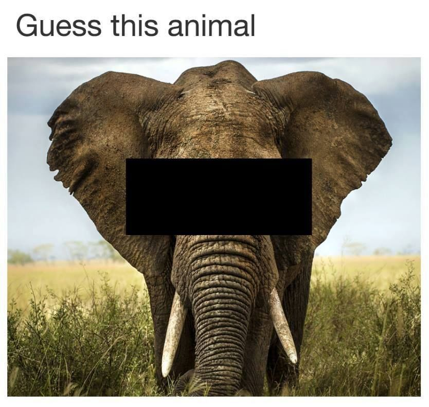

# <font color=blue|green|pink|yellow>Guess the animal</font> 


*Mireia Guinovart*

*Data Analysis 0620, Ironhack (25 June 2020)*

## Content

- [Project Description](#project-description)
- [Rules](#rules)
- [Workflow](#workflow)
- [Organization](#organization)
- [Links](#links)

## Project Description

This project is about learning. In this crazy world of ours, despite what some humans believe, we are not alone, we are surrounded by alive beings,plants, animals, fungii... and although some are more pleasants than others (no one likes the crazy neighbour shouting at 4am just because or that one mosquito that somehow has managed to get inside your room at night and has the most anoying flying sound that has ever existed) we can all agree that earth is our home. But do you really know their names? (apart from cat, dog, mushroom and weed that is) Do you know what an echinoderm is?. In this game you will be able to enhance your <font color=red>**ANIMAL**</font> (yeah yeah, just animals) naming skills and learn how to classify them among other things. 

## Rules

Rules are simple but also important:
- ```Do NOT be a cheater``` (no one likes those) and google stuff
- Only 3 guesses allowed
- Enjoy the game
- Learn a lot

## Workflow

The workflow followed was the following:
1. Planning the structure of the game and the steps to follow 
2. Retrieving the project folder from github and cloning it
3. Creating a .gitignore file
4. Preparing the read.me file with the game description
5. Coding the game
    1. Get the scrambled animal name (option to guess it straight away)
    2. Ask the directed questions to obtain extra info about the animal (questions limited to 3)
    3. Allow the user to decide whehter to guess or not after each question
    3. Guess the animal (only 3 tries)
    4. Show if they guessed it right or not
    5. Points based on how many guesses you took, how many tries to answer the questions and when in the game you managed to guess the animal.
6. Debbuging the game
7. Improving the game's interface and visualization
9. preparing the Slides presentation

## Organization

To mantain a structured workflow I used the Trello interface (kanbanboard) with checklists to keep track of my progress.
The organisation of the repository is fairly simple. It contains the .ipynb file with the game as well as .png/.jpeg files used in the design of the visual interface.


## Links

[Repository](https://github.com/mg365/Project-Week-1-Build-Your-Own-Game.git)  
[Slides](https://slides.com/mireiaguinovartcastan/guess-the-animal/edit)  
[Trello](https://trello.com/b/rJUPYtig/project-1-create-a-game)  